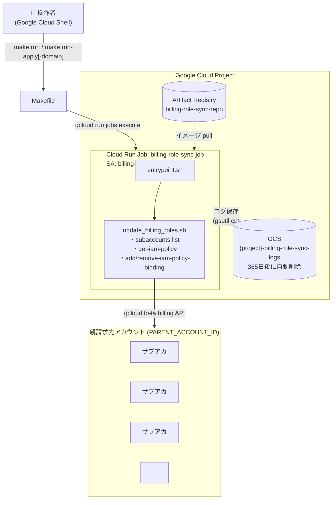

# billing-role-sync

Google Cloud の親請求先アカウント配下にある全サブアカウントの IAM 権限を、適正な状態へ同期するツールです。
現在は、顧客に付与されている `roles/billing.admin`（過剰権限）を最小権限の原則に基づいた権限セットへ自動的に置き換えます。

______________________________________________________________________

## 目次

1. [概要・背景](#%E6%A6%82%E8%A6%81%E8%83%8C%E6%99%AF)
1. [アーキテクチャ](#%E3%82%A2%E3%83%BC%E3%82%AD%E3%83%86%E3%82%AF%E3%83%81%E3%83%A3)
1. [ディレクトリ構成](#%E3%83%87%E3%82%A3%E3%83%AC%E3%82%AF%E3%83%88%E3%83%AA%E6%A7%8B%E6%88%90)
1. [前提条件](#%E5%89%8D%E6%8F%90%E6%9D%A1%E4%BB%B6)
1. [実行場所](#%E5%AE%9F%E8%A1%8C%E5%A0%B4%E6%89%80)
1. [初回セットアップ（エンジニア向け）](#%E5%88%9D%E5%9B%9E%E3%82%BB%E3%83%83%E3%83%88%E3%82%A2%E3%83%83%E3%83%97%E3%82%A8%E3%83%B3%E3%82%B8%E3%83%8B%E3%82%A2%E5%90%91%E3%81%91)
1. [利用者を追加する](#%E5%88%A9%E7%94%A8%E8%80%85%E3%82%92%E8%BF%BD%E5%8A%A0%E3%81%99%E3%82%8B)
1. [日常操作（担当者向け）](#%E6%97%A5%E5%B8%B8%E6%93%8D%E4%BD%9C%E6%8B%85%E5%BD%93%E8%80%85%E5%90%91%E3%81%91)
1. [コマンドリファレンス](#%E3%82%B3%E3%83%9E%E3%83%B3%E3%83%89%E3%83%AA%E3%83%95%E3%82%A1%E3%83%AC%E3%83%B3%E3%82%B9)
1. [インフラ詳細](#%E3%82%A4%E3%83%B3%E3%83%95%E3%83%A9%E8%A9%B3%E7%B4%B0)
1. [削除手順](#%E5%89%8A%E9%99%A4%E6%89%8B%E9%A0%86)
1. [トラブルシューティング](#%E3%83%88%E3%83%A9%E3%83%96%E3%83%AB%E3%82%B7%E3%83%A5%E3%83%BC%E3%83%86%E3%82%A3%E3%83%B3%E3%82%B0)

______________________________________________________________________

## 概要・背景

### 権限変更内容

| 操作 | ロール |
|------|--------|
| **剥奪** | `roles/billing.admin`（請求先アカウント管理者） |
| **付与** | `roles/billing.user`（請求先アカウントユーザー） |
| **付与** | `roles/billing.viewer`（請求先アカウント閲覧者） |
| **付与** | `roles/billing.costsManager`（請求先アカウント費用管理者） |

### 対象・除外

- **対象**: 親請求先アカウント配下の全サブアカウントの `user:*` メンバー
- **除外**: 自社ドメイン（`YOUR_DOMAIN`）を持つユーザー（運用管理者）
- **絞り込み**: `--target-domain` / `DOMAINS` で特定顧客ドメインのみを対象にすることも可能

### 安全設計

- デフォルトは **Dry-Run モード**（確認のみ、変更なし）
- `--apply` / `APPLY_MODE=true` を明示した場合のみ実際に変更
- 変更前に対話的な確認プロンプトを表示
- 全実行ログを GCS バケットに自動保存（365日後に自動削除）

______________________________________________________________________

## アーキテクチャ



______________________________________________________________________

## ディレクトリ構成

```
.
├── README.md                    # このファイル
├── Makefile                     # 全操作の入口
├── setup.sh                     # 初回セットアップ（対話形式）
├── Dockerfile                   # Cloud Run Job 用コンテナ定義
├── entrypoint.sh                # 環境変数 → スクリプト引数の変換 + ログアップロード
├── update_billing_roles.sh      # IAM権限更新スクリプト本体
├── terraform/
│   ├── providers.tf             # Terraform バックエンド・プロバイダ設定
│   ├── variables.tf             # 変数定義
│   ├── main.tf                  # リソース定義
│   └── outputs.tf               # 出力値
├── .env.example                 # 環境変数ファイルのサンプル
├── .gitignore
└── requriements.md              # 要件定義書
```

> **Git 管理について**
> `.env` と `terraform.tfvars` はプロジェクトIDやドメイン等の情報を含むためコミットしません（`.gitignore` で除外済み）。
> `terraform/.terraform.lock.hcl` はプロバイダバージョンを固定するためコミットしてください。

______________________________________________________________________

## 前提条件

### 実行環境

- Google Cloud Shell（推奨）またはローカル PC
- `gcloud` CLI（beta コンポーネント含む）
- `docker`（イメージビルド時のみ）
- `terraform` >= 1.5
- `make`

### GCP 権限

セットアップを実行するユーザーが以下の権限を持っていること：

| 権限 | 用途 |
|------|------|
| `roles/owner` または `roles/editor` | プロジェクトへのリソースデプロイ |
| `roles/billing.admin`（親請求先アカウント） | サービスアカウントへの権限委譲 |
| `roles/storage.admin` | TF ステートバケット・ログバケットの作成 |

______________________________________________________________________

## 実行場所

このツールは専用 UI を持ちません。`make` コマンドは以下のいずれかの場所で実行します。

### 方法 A: Google Cloud Shell（担当者・推奨）

ブラウザだけで完結し、追加インストール不要です。日常運用はこの方法を推奨します。

1. [Google Cloud Console](https://console.cloud.google.com/) を開き、対象プロジェクトを選択
1. 右上の **「Cloud Shell をアクティブ化」** アイコン（`>_` マーク）をクリック
1. **初回のみ**: リポジトリをクローン
   ```bash
   git clone <リポジトリURL>
   cd billing-role-sync
   ```
1. **2回目以降**: 既存のディレクトリへ移動
   ```bash
   cd ~/billing-role-sync
   git pull   # 最新版を取得する場合
   ```
1. `make run` などのコマンドを実行

> **メモ**
> Cloud Shell のホームディレクトリ（`~`）は永続化されるため、クローン済みのリポジトリは次回セッションでも残ります。

### 方法 B: ローカル PC のターミナル（エンジニア向け）

ローカルから実行する場合は [前提条件](#%E5%89%8D%E6%8F%90%E6%9D%A1%E4%BB%B6) に記載のツールをインストールし、事前に認証してください：

```bash
gcloud auth login
gcloud auth application-default login
gcloud config set project <PROJECT_ID>
```

その後はリポジトリをクローンして `make run` を実行します。

### 方法 C: Cloud Console から直接 Cloud Run Job を実行（コマンド不要）

`make` コマンドを使わず、ブラウザの UI だけでジョブを実行することも可能です。
初回セットアップが完了済みであることが前提です。

1. [Cloud Run Jobs](https://console.cloud.google.com/run/jobs) を開く

1. `billing-role-sync-job` をクリック

1. **「実行」** ボタンをクリック

1. **「コンテナ、変数とシークレット、接続、セキュリティ」** を展開

1. 「環境変数」で以下を上書き設定：

   | 実行内容 | `APPLY_MODE` | `TARGET_DOMAINS` |
   |---|---|---|
   | Dry-Run（全顧客） | `false`（既定） | （空のまま） |
   | Dry-Run（特定ドメイン） | `false`（既定） | `customer-a.com,customer-b.co.jp` |
   | 本番実行（全顧客） | **`true`** | （空のまま） |
   | 本番実行（特定ドメイン） | **`true`** | `customer-a.com` |

1. **「実行」** で開始

1. 実行結果は同画面の「実行履歴」、ログは `gs://{project}-billing-role-sync-logs/` で確認

> **⚠️ 注意**
> Cloud Console から実行する場合、`make run-apply` のような確認プロンプトは表示されません。
> `APPLY_MODE=true` を設定する際は事前に Dry-Run で対象を必ず確認してください。

______________________________________________________________________

## 初回セットアップ（エンジニア向け）

### Step 1. 設定ファイルの生成

```bash
make setup
```

対話形式で以下の情報を入力します：

| 入力項目 | 説明 | 例 |
|----------|------|-----|
| GCPプロジェクトID | ツールをデプロイするプロジェクト | `my-project-id` |
| リージョン | Cloud Run / Artifact Registry のリージョン | `asia-northeast1` |
| 親請求先アカウントID | 処理対象の親アカウント | `XXXXXX-XXXXXX-XXXXXX` |
| 自社ドメイン | 権限変更から**除外**するドメイン | `e-agency.co.jp` |
| TFステートバケット名 | Terraform の状態管理用バケット名 | `myproject-billing-role-sync-tfstate` |

完了すると `.env` と `terraform.tfvars` が生成されます。

### Step 2. Terraform の初期化

```bash
make init
```

TF ステートバケットの存在確認・自動作成と `terraform init` を実行します。

### Step 3. 初回デプロイ

```bash
make init-deploy
```

以下を順番に自動実行します：

1. **Artifact Registry の作成**（イメージプッシュの準備）
1. **Docker イメージのビルド＆プッシュ**
1. **残りのインフラ全体を作成**（SA・ログバケット・Cloud Run Job）

完了後、以下のリソースが作成されます：

| リソース | 名前 |
|----------|------|
| Service Account | `billing-role-sync-sa@{project}.iam.gserviceaccount.com` |
| Artifact Registry | `{region}-docker.pkg.dev/{project}/billing-role-sync-repo` |
| Cloud Run Job | `billing-role-sync-job` |
| GCS（ログ） | `{project}-billing-role-sync-logs` |
| GCS（TF state） | `{project}-billing-role-sync-tfstate`（Terraform管理外） |

### Step 4. 動作確認

```bash
make run
```

Dry-Run を実行し、対象ユーザーの一覧が表示されれば正常です。

______________________________________________________________________

## 利用者を追加する

このシステムはデプロイ済みの Cloud Run Job を **複数人で共有して利用できる** 設計です。
デプロイ者（管理者）が新しい利用者（担当者）に必要な IAM 権限を付与すれば、すぐにツールを使い始められます。

### Step 1. 管理者が IAM 権限を付与する

新しい利用者には以下の最小権限を付与します。

| ロール | 付与対象 | 用途 |
|---|---|---|
| `roles/run.invoker` | Cloud Run Job `billing-role-sync-job` | ジョブの実行 |
| `roles/storage.objectViewer` | GCS バケット `{project}-billing-role-sync-logs` | ログの閲覧 |

管理者が以下のコマンドを実行（`<NEW_USER_EMAIL>` を実際のメールアドレスに置き換え）：

```bash
# ジョブの実行権限を付与
gcloud run jobs add-iam-policy-binding billing-role-sync-job \
  --region=asia-northeast1 \
  --project=<PROJECT_ID> \
  --member="user:<NEW_USER_EMAIL>" \
  --role="roles/run.invoker"

# ログ閲覧権限を付与
gcloud storage buckets add-iam-policy-binding gs://<PROJECT_ID>-billing-role-sync-logs \
  --member="user:<NEW_USER_EMAIL>" \
  --role="roles/storage.objectViewer"
```

### Step 2. 利用者が利用を開始する

利用者は2つの方法から選べます。

#### 方法 A: Cloud Console から直接実行（コマンド不要・最も簡単）

リポジトリのクローン不要。[実行場所 → 方法 C](#%E5%AE%9F%E8%A1%8C%E5%A0%B4%E6%89%80) の手順をそのまま実施します。

#### 方法 B: Cloud Shell から `make` コマンドを実行

```bash
# 利用者が実行
git clone <リポジトリURL>
cd billing-role-sync
gcloud config set project <PROJECT_ID>
make run                                            # Dry-Run（全顧客）
make run-domain DOMAINS=customer-a.com              # Dry-Run（特定ドメイン）
```

> **メモ**
> `make run` 系は既存の Cloud Run Job を実行するだけなので、利用者は以下が **不要** です：
>
> - `make setup`（`.env` / `terraform.tfvars` の生成）
> - `make init` / `make apply` / `make init-deploy` などの Terraform 操作
> - `make build` / `make push` などのコンテナ操作
>
> `gcloud config set project <PROJECT_ID>` で対象プロジェクトを指定するだけで `make run` が動きます。

### 権限の取り消し

利用者を外す場合：

```bash
gcloud run jobs remove-iam-policy-binding billing-role-sync-job \
  --region=asia-northeast1 \
  --project=<PROJECT_ID> \
  --member="user:<USER_EMAIL>" \
  --role="roles/run.invoker"

gcloud storage buckets remove-iam-policy-binding gs://<PROJECT_ID>-billing-role-sync-logs \
  --member="user:<USER_EMAIL>" \
  --role="roles/storage.objectViewer"
```

### 役割の整理

| 役割 | 担う作業 | 必要な権限 |
|---|---|---|
| **管理者** | 初回デプロイ・更新・削除・利用者の追加 | プロジェクト Owner/Editor、親請求先アカウント `billing.admin` |
| **利用者** | Dry-Run / 本番実行 / ログ閲覧のみ | `run.invoker` + `storage.objectViewer`（上記の通り） |

______________________________________________________________________

## 日常操作（担当者向け）

> **前提**
> 初回セットアップ済みで、[実行場所](#%E5%AE%9F%E8%A1%8C%E5%A0%B4%E6%89%80) の方法 A（Cloud Shell）でリポジトリのディレクトリに移動済みであること。
> コマンドを使いたくない場合は [方法 C（Cloud Console から直接実行）](#%E5%AE%9F%E8%A1%8C%E5%A0%B4%E6%89%80) を参照してください。

### 対象ユーザーの確認（変更なし）

実際の変更は行わず、対象となるユーザーを確認します。

```bash
# 全顧客を対象に確認
make run

# 特定ドメインのみ確認（複数ドメインはカンマ区切り）
make run-domain DOMAINS=customer-a.com
make run-domain DOMAINS=customer-a.com,customer-b.co.jp
```

### 権限変更の実行

**必ず Dry-Run で確認してから実行してください。**

```bash
# 全顧客の権限を変更
make run-apply

# 特定ドメインのみ変更
make run-apply-domain DOMAINS=customer-a.com
make run-apply-domain DOMAINS=customer-a.com,customer-b.co.jp
```

`yes` と入力した場合のみ実行されます：

```
==========================================
 【警告】実際に権限変更を行います
==========================================
本当に実行しますか？ (yes/no):
```

### ログの確認

```bash
# 直近の実行ログを表示
make logs

# 過去のログファイル一覧を表示
make logs-list
```

ログファイルは `gs://{project}-billing-role-sync-logs/` に保存されます。Cloud Console から [Cloud Storage](https://console.cloud.google.com/storage) でも確認できます。

______________________________________________________________________

## コマンドリファレンス

`make help` で一覧を確認できます。

```
help                   コマンド一覧を表示
setup                  対話形式でセットアップ（.env と terraform.tfvars を生成）
init                   TFステートバケット作成 + terraform init
plan                   terraform plan（変更内容を事前確認）
apply                  terraform apply（インフラ作成・更新）
destroy                インフラを全削除（APIの無効化は除く）
build                  Dockerイメージをビルド
push                   Dockerイメージをビルド＆Artifact Registryへプッシュ
init-deploy            【初回のみ】Artifact Registry作成 → イメージビルド → 全インフラ作成
deploy                 イメージ更新＋インフラ更新（2回目以降の更新用）
run                    DRY-RUN: 全顧客の対象ユーザーを確認（変更なし）
run-domain             DRY-RUN: ドメイン指定で確認（例: make run-domain DOMAINS=a.com,b.co.jp）
run-apply              APPLY: 全顧客の権限を実際に変更（確認プロンプトあり）
run-apply-domain       APPLY: ドメイン指定で実際に変更（例: make run-apply-domain DOMAINS=a.com,b.co.jp）
logs                   直近のジョブ実行ログを GCS から取得して表示
logs-list              GCS に保存されたログファイル一覧を表示
```

### スクリプト直接実行（エンジニア向け）

Cloud Shell 上でスクリプトを直接実行することも可能です：

```bash
# Dry-Run（全顧客）
./update_billing_roles.sh

# 特定ドメインのみ Dry-Run
./update_billing_roles.sh --target-domain customer-a.com
./update_billing_roles.sh --target-domain customer-a.com --target-domain customer-b.co.jp

# 実際に変更（全顧客）
./update_billing_roles.sh --apply

# 実際に変更（特定ドメイン）
./update_billing_roles.sh --target-domain customer-a.com --apply
```

______________________________________________________________________

## インフラ詳細

### 作成されるリソース

| リソース種別 | リソース名 | 用途 |
|---|---|---|
| Service Account | `billing-role-sync-sa` | Cloud Run Job の実行 ID |
| Billing IAM Binding | `roles/billing.admin` | 親請求先アカウントへのAPI操作権限 |
| Artifact Registry | `billing-role-sync-repo` | コンテナイメージの保管 |
| Cloud Run Job | `billing-role-sync-job` | スクリプトの実行環境 |
| GCS Bucket | `{project}-billing-role-sync-logs` | 実行ログの永続保存 |
| Storage IAM Binding | `roles/storage.objectCreator` | SA からログバケットへの書き込み権限 |

### API 有効化（destroy 時に無効化しない）

| API | 用途 |
|---|---|
| `run.googleapis.com` | Cloud Run |
| `artifactregistry.googleapis.com` | Artifact Registry |
| `iam.googleapis.com` | IAM |
| `storage.googleapis.com` | Cloud Storage |

> 同プロジェクトに他のアプリもデプロイされているため、`disable_on_destroy = false` を設定しています。

### ログ保管ポリシー

- 保存先: `gs://{project}-billing-role-sync-logs/`
- ファイル名: `billing_role_update_log_YYYYMMDD_HHMMSS.txt`
- 自動削除: **365日後**（GCS Lifecycle ルールで管理）
- `make destroy` 実行時: バケットごと削除（`force_destroy = true`）

### Cloud Run Job の環境変数

| 変数名 | 説明 | 実行時上書き |
|---|---|---|
| `PARENT_ACCOUNT_ID` | 親請求先アカウントID | 不可（Terraform で固定） |
| `YOUR_DOMAIN` | 除外対象の自社ドメイン | 不可（Terraform で固定） |
| `LOG_BUCKET` | ログ保存先バケット名 | 不可（Terraform で固定） |
| `APPLY_MODE` | `true` で実際に変更、`false` で Dry-Run | `--update-env-vars` で上書き可 |
| `TARGET_DOMAINS` | 対象ドメイン（カンマ区切り、空=全顧客） | `--update-env-vars` で上書き可 |

______________________________________________________________________

## 削除手順

```bash
make destroy
```

以下のリソースが**削除**されます：

- Cloud Run Job
- Artifact Registry（イメージ含む）
- Service Account
- Billing IAM Binding
- GCS ログバケット（ログファイル含む）

以下は**削除されません**：

- 有効化した API（他アプリへの影響を防ぐため）
- TF ステートバケット（`make destroy` 完了後に手動で削除）

```bash
# TF ステートバケットの手動削除（完全削除する場合のみ）
gcloud storage rm -r gs://{project}-billing-role-sync-tfstate
```

______________________________________________________________________

## トラブルシューティング

### `make init` でバケット作成に失敗する

```
ERROR: (gcloud.storage.buckets.create) HTTPError 403: ...
```

→ `roles/storage.admin` または `roles/editor` 権限があるか確認してください。

```bash
gcloud projects get-iam-policy $(gcloud config get-value project) \
  --flatten="bindings[].members" \
  --filter="bindings.members:$(gcloud config get-value account)"
```

### `make push` で認証エラーが出る

```
unauthorized: You don't have the needed permissions to perform this operation
```

→ Docker の認証設定を更新してください。

```bash
gcloud auth configure-docker asia-northeast1-docker.pkg.dev
```

### Cloud Run Job が `FAILED` になる

```bash
# 実行ログを確認
make logs

# Cloud Logging で詳細を確認
gcloud logging read \
  'resource.type="cloud_run_job" AND resource.labels.job_name="billing-role-sync-job"' \
  --project=$(gcloud config get-value project) \
  --limit=50
```

よくある原因：

- SA に `roles/billing.admin` が付与されていない → `make apply` を再実行
- 親請求先アカウントIDが誤っている → `terraform.tfvars` を確認

### `make run` で対象ユーザーが表示されない

- 対象サブアカウントに `roles/billing.admin` を持つ `user:*` メンバーが存在しない場合は正常です
- `DOMAINS` を指定している場合、該当ドメインのユーザーが存在しない可能性があります

### Terraform state が壊れた・初期化をやり直したい

```bash
# バックエンド設定を再初期化
terraform -chdir=terraform init \
  -backend-config="bucket=$(cat .env | grep TF_STATE_BUCKET | cut -d= -f2)" \
  -backend-config="prefix=billing-role-sync/tfstate" \
  -reconfigure
```

### イメージを更新した場合

スクリプトを修正した場合はイメージを再ビルド・再プッシュしてください：

```bash
make deploy
```
